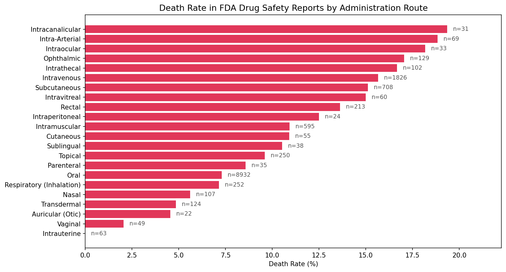

# OpenFDA Adverse Event Data Pipeline

This project explores large-scale biomedical adverse event data using MongoDB as a document store, demonstrating document-oriented data modeling and aggregation pipeline design.

The dataset is retrieved from the [OpenFDA Drug Adverse Event API](https://open.fda.gov/apis/drug/event/) and contains 5,000 adverse event reports with deeply nested patient demographics, drug exposures, and reaction data. The system includes a data ingestion pipeline, a PyMongo API abstraction layer, MongoDB aggregation queries, and a visualization analyzing death rates across drug administration routes.

## Why MongoDB?

Each adverse event report contains multiple levels of nesting (report > patient > drug > openfda), including variable-length arrays of drugs and reactions per patient. Modeling each report as a single document enables MongoDB's aggregation pipeline to traverse nested arrays without relational joins, making it well-suited for hierarchical pharmacovigilance data.

## Key Findings

- **Invasive routes carry higher death rates.** Intra-arterial (18.8%), intrathecal (16.7%), and intravenous (15.7%) routes top the chart, consistent with their common use in critical care and oncology settings.
- **Sample size matters.** Routes like intracanalicular (n=31) rank highest at 19.4%, but the small sample makes that unreliable compared to oral (n=8932) at 7.3%.
- **Reporting volume is heavily concentrated in the United States** (3,820 of 5,000 reports), followed by GB (United Kingdom, 155) and JP (Japan, 102), reflecting reporting practices rather than true incidence rates.
- **Females outnumber males ~2:1** in adverse event reports (3,197 vs 1,469), consistent with known reporting patterns in pharmacovigilance literature.
- **Consumers file the majority of reports** (2,758), followed by physicians (930) and other health professionals (754).



Results describe patterns within spontaneously submitted FDA safety reports and do not estimate causal or population-level risk.

**Analysis limitation:** Administration-route counts are calculated after unwinding nested drug and route arrays, so a single safety report may contribute multiple observations. These findings are exploratory and should not be interpreted as causal or population-level risk estimates.

## Architecture Overview

- **`fetch_data.py`** -- Pulls adverse event records from the OpenFDA REST API in batches with rate-limit handling, writes to JSON and compressed ZIP
- **`load_data.py`** -- Bulk-inserts JSON into MongoDB, creates indexes on frequently queried fields
- **`adverse_event_api.py`** -- PyMongo abstraction layer with parameterized methods for querying and aggregation
- **`visualize.py`** -- Generates matplotlib charts from API output

## Setup

Requires Python 3.10+ and Docker.

```bash
pip install -r requirements.txt
docker compose up -d
```

### Pull data and load into MongoDB

```bash
python src/fetch_data.py
python src/load_data.py
```

### Sample queries

Open `mongosh` and switch to the `openfda` database:

```bash
mongosh
use openfda
```

Queries are in `examples/sample_queries.txt`.

### Generate the visualization

```bash
python src/visualize.py
```

### Run tests

```bash
pytest tests/ -v
```

## API Methods

| Method | Parameters | Description |
|--------|-----------|-------------|
| `get_events_by_drug` | drug_name, serious_only, limit | Find adverse event reports for a specific drug |
| `get_reaction_frequency` | drug_name, top_n | Count reaction types for a given drug |
| `get_demographic_breakdown` | drug_name, group_by | Group events by sex, age, or country |
| `get_top_drugs_by_event_count` | serious_only, top_n | Rank drugs by total adverse event reports |
| `get_death_rate_by_route` | min_reports | Compare death rates across drug administration routes |

All API methods are implemented using PyMongo and return JSON-serializable Python dictionaries for downstream analysis.
